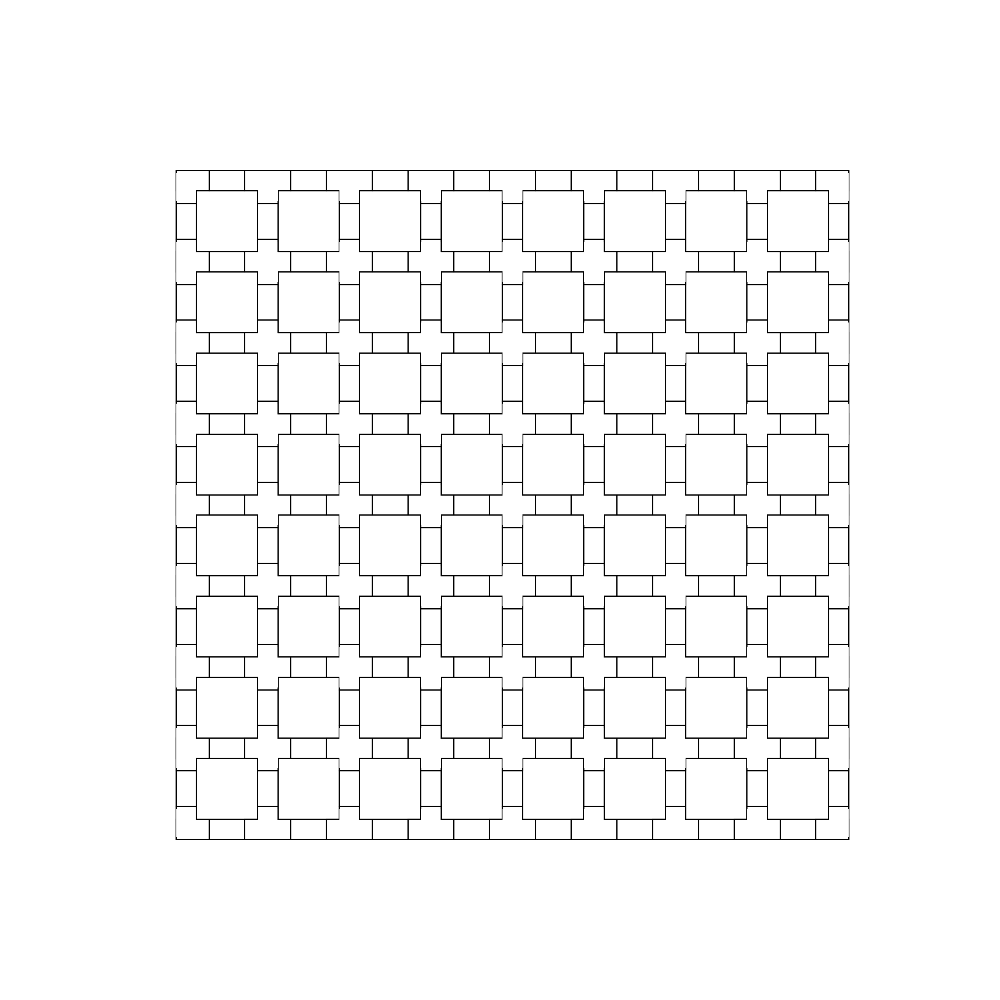

# EF_eFPGA

## Overview

> **This is an embedded FPGA IP in SKY130 technology, in a compact 2475.0um X 2715.0um area.**

## Status

*  Maturity: Silicon Validated
*  Certification: ((???))
*  [See below for tapeout/test history](#tapeout-history)


## Installation:

You can either clone repo or use [IPM](https://github.com/efabless/IPM "IPM") which is an open-source IPs Package Manager

- To clone repo: `git clone https://github.com/efabless/EF_eFPGA`
- To download via IPM , follow installation guides [here](https://github.com/efabless/IPM/blob/main/README.md "here") then run `ipm install EF_eFPGA`

For an example on integrating this IP into your project, see the following [Github Repo](https://github.com/efabless/clear).

## Features:

- It consists of 8x8 CLB (Configurable Logic Block) matrix, which makes a total of 64 CLBs
- Each CLB contains 6 LUTs (LookUp Tables) and 6 FFs (Flip Flops) which makes a total of 384 LUTs and 384 FFs
- It has 128 FPGA IOs.

## Floorplan



## Pin Description

|   NAME | TYPE | DIRECTION | DESCRIPTION   |
| :---: | :---: | :---: | :--- |
|   ccff_head | CMOS | IN | This input value is the head of the configuration chain, used to configure the FPGA.   |
|   clk | CMOS | IN | This is the FPGA clock input pin.   |
|   gfpga_pad_io_soc_in [127:0] | CMOS | IN | 128 FPGA Input pins.   |
|   isol_n | CMOS | IN | This input value is used to isolate the FPGA IOs while configuring the FPGA.   |
|   prog_clk | CMOS | IN | This is the programing input clock pin, used while configuring the FPGA.   |
|   prog_reset | CMOS | IN | This is the enable to get the FPGA in the configuration state.   |
|   reset | CMOS | IN | This is the enable to get the FPGA in the running state.   |
|   sc_head | CMOS | IN | This is the scan chain head, used for debugging and testing the FPGA.   |
|   test_enable | CMOS | IN | This is a test enable input pin, used for debugging and testing the FPGA.   |
|   ccff_tail | CMOS | OUT | This is an output from the configuration chain, used for debugging and testing the FPGA.   |
|   gfpga_pad_io_soc_dir [127:0] | CMOS | OUT | Used to determine the direction of the FPGA IO.   |
|   gfpga_pad_io_soc_out [127:0] | CMOS | OUT | This is the 128 output FPGA pins.    |
|   sc_tail | CMOS | OUT | This is the output from the scan chain, used for debugging and testing the FPGA.   |

## Tapeout History

|   Shuttle | Date      | Revision | Test results   |
|----------:|----------:|---------:|----------------|
| CI2404    | June 2024 | 001      | Blah blah blah |


## Steps for using OpenFPGA to generate bitstream for SOFA FPGA fabric

1. Clone this repo
   ```
   git clone https://github.com/efabless/OpenFPGA_bitstream_generation.git
   ```
  
2. Switch to SOFA branch
   ```
   cd OpenFPGA_bitstream_generation
   git checkout SOFA
   ```
3. Install dependencies
   ```
   pip install -r requirements.txt
   ```
5. Place the rtl design inside [this](https://github.com/efabless/OpenFPGA_bitstream_generation/tree/SOFA/openfpga_flow/benchmarks/micro_benchmark) directory ```OpenFPGA/openfpga_flow/benchmarks/micro_benchmark``` where also you can find other example designs
6. Create a .pcf file for the design and place in [this](https://github.com/efabless/OpenFPGA_bitstream_generation/tree/SOFA/openfpga_flow/tasks/SOFA_tasks/pcf_files) directory ```OpenFPGA/openfpga_flow/tasks/SOFA_tasks/pcf_files```. This is an example of a pcf file for [ALU_4bits](https://github.com/efabless/OpenFPGA_bitstream_generation/blob/SOFA/openfpga_flow/benchmarks/micro_benchmark/ALU_4bits.v):
```
set_io operand_A[0] gfpga_pad_io_soc_in[46]
set_io operand_A[1] gfpga_pad_io_soc_in[45]
set_io operand_A[2] gfpga_pad_io_soc_in[44]
set_io operand_A[3] gfpga_pad_io_soc_in[43]

set_io operand_B[0] gfpga_pad_io_soc_in[42]
set_io operand_B[1] gfpga_pad_io_soc_in[41]
set_io operand_B[2] gfpga_pad_io_soc_in[40]
set_io operand_B[3] gfpga_pad_io_soc_in[39]

set_io operation[0] gfpga_pad_io_soc_in[37]
set_io operation[1] gfpga_pad_io_soc_in[36]

set_io result[0] gfpga_pad_io_soc_out[127]
set_io result[1] gfpga_pad_io_soc_out[125]
set_io result[2] gfpga_pad_io_soc_out[123]
set_io result[3] gfpga_pad_io_soc_out[122]
```
Important Notes: 
* Change ``operand_A`` , ``operand_B``, ``operation``, and ``result`` to the ports of your rtl design.  
* If you didn't create a pcf file, the design ports to be assigned to random FPGA ios. 
* OpenFPGA can detect the clk port in the design and connect it to the FPGA clk automatically.
       
6. You should change some variables in the ``task.conf`` file you can find inside [this](https://github.com/efabless/OpenFPGA_bitstream_generation/tree/SOFA/openfpga_flow/tasks/SOFA_tasks/config) directory ``OpenFPGA/openfpga_flow/tasks/SOFA_tasks/config`` . This file points to all the files we will need like the openFPGA command files , the FPGA architecture xml files, the design to be implemented on the fabric , as well as the pin constraints file of the design. 
Make sure to change the following in ``task.conf`` according to the design:
    - In ``[OpenFPGA_SHELL]``, change ``openfpga_pcf`` variable to point to pcf file of the design 
    - In ``[OpenFPGA_SHELL]``, change ``openfpga_vpr_fix_pins_file`` variable to the name and path of the .place file which will be generated
    - In ``[BENCHMARKS]``, change ``bench0`` to point to the path of the verilog file/s of the design you want to implement 
    - In ``[SYNTHESIS_PARAM]`` change ``bench0_top`` to be the name of the top module of the design 

7. After placing the rtl and pcf and editing task.conf, you should just run 
```
python3 openfpga_flow/scripts/run_fpga_task.py SOFA_tasks
```
8. You will find all the files related to the run in a folder inside the task in the directory ``OpenFPGA/openfpga_flow/tasks/SOFA_tasks/run_xx`` . It will contain all results like the fabric src files, the synthesized design, a testbech , the bitstream, and the io_mapping.

## VPR and Yosys results for different designs   

|   Design        | # CLBs  | CLB Util |# I/O Blocks | # FFs | # LUT |
| --------------- | ----------- |-------- |--------- |-------|----------|
| [fpga_ram8x20](https://github.com/efabless/OpenFPGA_bitstream_generation/blob/SOFA/openfpga_flow/benchmarks/micro_benchmark/fpga_ram8x20.v)    | 41          |64%| 23        | 168 | 316 |
| [fpga_ram8x16](https://github.com/efabless/OpenFPGA_bitstream_generation/blob/SOFA/openfpga_flow/benchmarks/micro_benchmark/fpga_ram8x16.v)    | 33          | 51.5%|22        | 136 | 252 |
| [fpga_mac_6x6](https://github.com/efabless/OpenFPGA_bitstream_generation/blob/SOFA/openfpga_flow/benchmarks/micro_benchmark/fpga_mac_6x6.v)    | 14          | 21.9%|26        | 13 | 108 |
| [fpga_LFSR](https://github.com/efabless/OpenFPGA_bitstream_generation/blob/SOFA/openfpga_flow/benchmarks/micro_benchmark/fpga_LFSR.v)       | 8           | 12.5%|25        | 48 | 60 |
| [fpga_seq_mul](https://github.com/efabless/OpenFPGA_bitstream_generation/blob/SOFA/openfpga_flow/benchmarks/micro_benchmark/fpga_seq_mul.v)    | 8           |12.5%| 34        | 28 | 65 |
| [fpga_mac](https://github.com/efabless/OpenFPGA_bitstream_generation/blob/SOFA/openfpga_flow/benchmarks/micro_benchmark/fpga_mac.v)        | 7           | 11%| 18        | 9 | 47 |
| [seconds_decoder](https://github.com/efabless/OpenFPGA_bitstream_generation/blob/SOFA/openfpga_flow/benchmarks/micro_benchmark/seconds_decoder.v) | 7           |11%| 9         | 35 | 50 |
| [fpga_ring16](https://github.com/efabless/OpenFPGA_bitstream_generation/blob/SOFA/openfpga_flow/benchmarks/micro_benchmark/fpga_ring16.v)     | 7           |11%| 17        | 40 | 52 |
| [fpga_pwm8](https://github.com/efabless/OpenFPGA_bitstream_generation/blob/SOFA/openfpga_flow/benchmarks/micro_benchmark/fpga_pwm8.v)       | 3           |4.7%| 18        | 9 | 22 |
| [ALU_4bits](https://github.com/efabless/OpenFPGA_bitstream_generation/blob/SOFA/openfpga_flow/benchmarks/micro_benchmark/ALU_4bits.v)       | 2           |3.13%| 14        | 0 | 12 |
